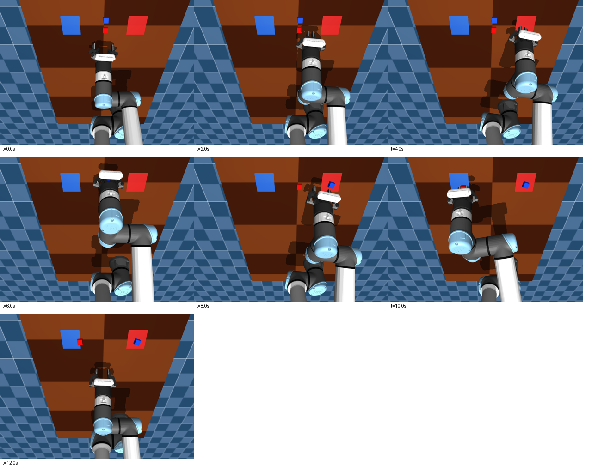

# SmolVLA 红蓝任务诊断（2026-09-09）

## 结论

已在不受 ROS/计算等待影响的闭环 MuJoCo 中复现蓝块进入红区。证据更支持“初始状态偏离示范后出现抓取/动作误差，失败后没有可靠恢复，并沿用了固定阶段的放置行为”，而不是已证明视觉模块不能辨色。冻结视觉能力不足仍可能是背景因素，但本次不能把它确定为根因。

## 训练数据检查

- 读取训练机器原始 LeRobot 红蓝数据：57 回合、14,933 帧、30 FPS；临时副本位于 `/tmp/smolvla_audit_dataset`，没有恢复到项目训练目录。
- 由记录的关节状态经当前模型 FK 还原 TCP：57/57 首先进入红区，随后进入蓝区。自动规则是 TCP 在目标中心 XY 各 7 cm 内、Z<18 cm、夹爪角度>0.4 rad；这是目标访问顺序，不等同于准确抓取事件。
- 57 张最终画面人工浏览均显示方块在对应颜色区域；并查看了回合 0 的过程图。没有把这项视觉检查当成精确的逐帧成功标注。
- 用 HSV 连通域识别 57 张起始图像中的两块方块。红块在蓝块左侧 30/57，红块在蓝块上方 30/57；未发现简单固定左右/上下颜色位置偏差。
- 原始数据提示词为“把红色和蓝色方块分别放到对应颜色区域”，与当前默认提示词相同。
- 当前与数据画面的蓝区中心约为 (232.91,82.05) 像素，红区中心相差不到 1 像素；未发现前视目标区位置明显变化。此项不代表已全面验证全部相机参数。

## 起始状态与模型对照

当前默认复位 TCP 世界坐标 X≈0.1566 m；示范起点中位数 X≈0.0232 m，49/57 起点 X<0.06 m。示范起点对照使用回合 0 的真实七维状态，初始方块位置保持配对一致。

每组使用随机种子 42、7、1、2、3、4，每个种子测试原始和交换红蓝初始位置，共 12 个场景。每回合推进 12 秒仿真时间，动作 30 Hz；计算期间物理时间暂停。SmolVLA 的 Torch 种子设为 1000。使用本地 ACT 050000 与 SmolVLA 020000，默认中文提示词。缩短窗口仅在临时测试进程中修改 `n_action_steps`，没有修改检查点。

| 条件 | 回合数 | 末态双块对应区域 | 末态蓝块在红区 |
|---|---:|---:|---:|
| ACT / current reset / 100 actions | 12 | 9 | 0 |
| SmolVLA / current reset / 50 actions | 12 | 1 | 2 |
| SmolVLA / demonstration start / 50 actions | 12 | 7 | 0 |
| SmolVLA / current reset / 10 actions | 12 | 2 | 3 |

计分按方块中心落入对应目标 XY 范围（中心±4.5 cm）且 Z<2 cm。它是固定 12 秒末态的位置判据，不是充分验证的完整任务成功判据。未完成可能包含超过时间预算的回合；表格仅为小样本诊断，不能当作正式成功率，GPU/接触数值变化也可能影响重复结果。早期 4 回合试跑不纳入本表。

## 一次错误的时间线

SmolVLA、当前复位、种子 1、原始位置：

- 0–4 秒：两块都未被带走，TCP 却已经移动到红区附近，属于空抓后仍执行放置轨迹。
- 约 6.5 秒：蓝块被带离原位置；7.5 秒左右放到红区。
- 随后抓取红块，送向蓝区；12 秒末红块停在蓝区边缘外。
- 最终蓝块中心约 (0.2418,-0.1609,0.0118) m，红区中心为 (0.25,-0.16) m。

## 使用训练观察的动作误差检查

选取训练回合 0、14、28、42，各取偏移 0、40、80、140、180 帧，共 20 个双相机观察。给定真实关节状态与图像，比较预测后续 20 步与记录 action。SmolVLA 每个观察使用三个噪声种子（1000–1002）；ACT 单次。

- 六个机械臂关节的整体平均绝对误差：ACT 0.00993 rad；SmolVLA 0.01466 rad。
- 起始帧后 20 步：ACT 0.01263 rad；SmolVLA 0.02898 rad，约 2.29 倍。
- 其余所选帧：ACT 0.00925 rad；SmolVLA 0.01108 rad。
- 此为训练样本诊断，不能当成独立验证集，也不能与 flow-matching 训练 loss 直接比较。

## 下一步优先级

1. 推理阶段建立与示范一致、明确声明的起始姿态；先在仿真中扩大种子与模型噪声重复次数验证，不直接改遥操作复位。
2. 检查并补充空抓后的重试、实际抓到蓝块时放蓝区、先蓝后红等示范，降低失败后的阶段混淆。反向顺序本身不是保证有效的修复。
3. 用任务成功和错放率选择不同训练检查点，而非只看训练 loss；再考虑视觉语言主干的微调范围。
4. 不把单纯缩短动作窗口作为已验证修复；见对照结果。异步推理可以改善延迟，但无法单独解释本次无等待仿真中的错误。

## 复现材料

原始诊断脚本与数值文件保留在本机 `/tmp/smolvla_audit/`，属于临时文件；本报告和下列图片已归档到项目 `docs/`。

- `inspect_data.py`、`positions.py`：示范轨迹、初始颜色位置和过程/终态图检查。
- `rollouts.py`：成对闭环仿真；运行前加载本项目 ROS 工作空间与虚拟环境，设置 `MUJOCO_GL=egl`。第二参数为 `current` 或 `demo`，可用第三参数 `10` 缩短执行窗口。
- `sample_observations.py`、`offline_errors.py`：真实训练观察与动作比较。
- `*_rollouts.json`、`*_trace.json`、`*_offline_errors.json`：完整原始数值。
- [示范过程与起始画面](assets/smolvla/contact.png)、[57 个回合的最终画面](assets/smolvla/ends.png)。

所有实验使用临时脚本、数据和内存中的仿真状态；未修改项目源码、训练权重或远端训练文件，未启动实体机械臂。
